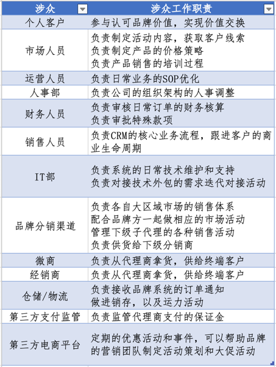
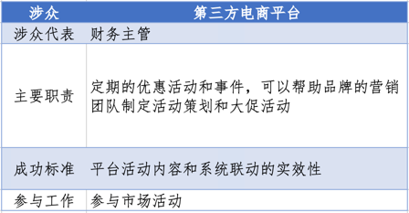
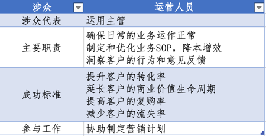
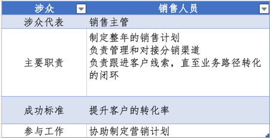
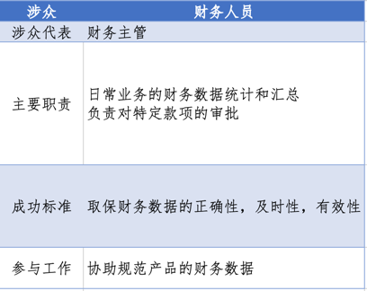
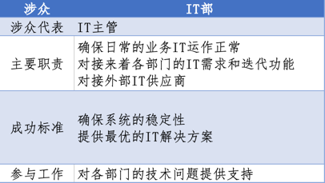
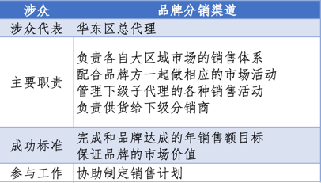
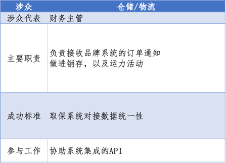
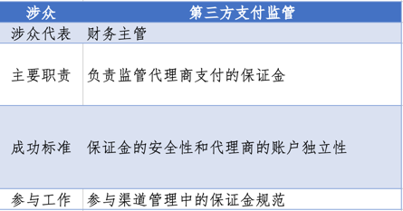
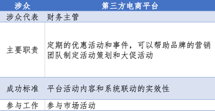

# 梳理涉众的期望

## 挖掘涉众的工作职责

### 涉众工作职责简表

{width=480}

---

### 涉众工作职责详情

#### 品牌内部涉众

{width=480}

{width=480}

{width=480}

{width=480}

{width=480}

---
#### 品牌外部涉众
{width=480}

{width=480}

---
#### 第三方涉众
{width=480}

{width=480}

下载文档资源：[solution.xlsx](/docs/public/resources/solution.xlsx)