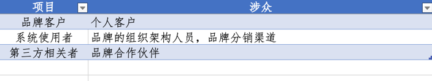

# 涉众

## 什么是涉众
涉众(Stakeholder)也被称为利益相关者、干系者或影响者。在工作中，也可用“利益相关者”这个词代替。

涉众是指影响产品，或受到产品影响的任何人、团队或组织。

因为PowerX是一套解决BBC的业务关系模式，所以围绕几个角度，列出以下几个涉众

### 从品牌方角度

* 品牌客户
  * 个人客户
* 品牌的组织架构
  * 行政部
  * 财务部
  * 市场部
  * 运营部
  * 销售部
  * 人事部
  * IT部
  * 其他
* 品牌分销渠道
  * 总代理
  * n级代理
  * 门店
  * 经销商
* 品牌合作伙伴
  * 外包物流存储
  * 第三方垫资方
  * 第三方电商平台

### 从系统角度

* 使用方/查看方
  * 品牌的组织架构
  * 品牌分销渠道
  * 品牌客户
* 系统维护者
  * 系统开发供应商
  * IT部门
  

### 所以涉众的人员汇总

